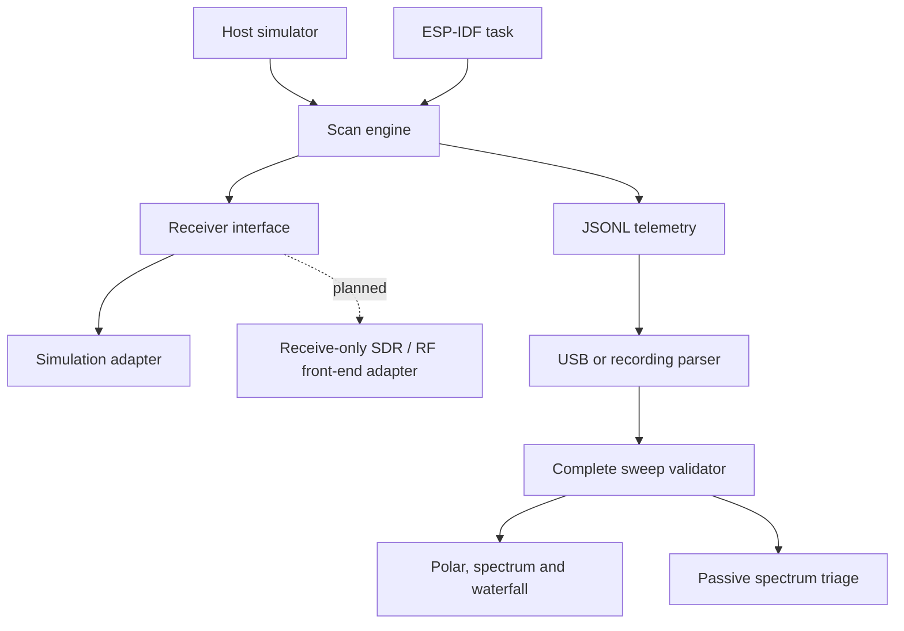

# Architecture

## Implemented v0.2

The same `rf::Scanner` C++17 class runs on a host and in ESP-IDF. Its only dependency is a `Receiver` interface (`supports`, `tune`, `read`, `standby`). One task owns the receiver and scanner; the interface is deliberately not thread-safe. The supplied adapter is deterministic simulation only.

Space-science presets are browser-side observation fixtures. They define bounded frequency grids for software testing; they do not claim that the ESP32 or current firmware can physically receive those bands. The HI preset carries the rounded 21-cm neutral-hydrogen reference frequency so downstream science tools can report offsets without hiding the reference.

- Scan plans use integer Hz and a 64-bit intermediate for frequency arithmetic.
- The scan array has 512 slots; invalid plans are rejected before tuning.
- `tick` takes a monotonic millisecond clock. It never delays, allocates or reads before dwell time.
- A tune/read/sample error invokes standby and enters fault.
- Browser history retains 100 sweeps. Export retains at most 20,000 samples.
- Only complete, ordered sweeps are committed to charts.
- Simulation/device provenance remains explicit.

## Extension boundaries

1. Implement CC1101 only after a confirmed module/board is available and validate it against known laboratory inputs.
2. Implement Si4735 through a separate adapter and preserve its real units/receiver limits.
3. PCNT/RMT pulse data requires a separate typed event schema.
4. Add a receive-only SDR gateway for space-science acquisition; keep raw acquisition separate from visualization.
5. Add session metadata, calibration, integration time, spectral resolution and RFI quality flags before treating measurements as scientific records.

No RF transmission, jamming, communications interception/decryption, remote device control, military target tracking or physical radar measurement is implemented.

## Development workflow

Keep domain code independent of ESP-IDF. Add fault-injection tests with every physical adapter. Keep simulation marked as simulation even when running on a physical ESP32. Verify host, browser, firmware compilation and physical hardware independently.
