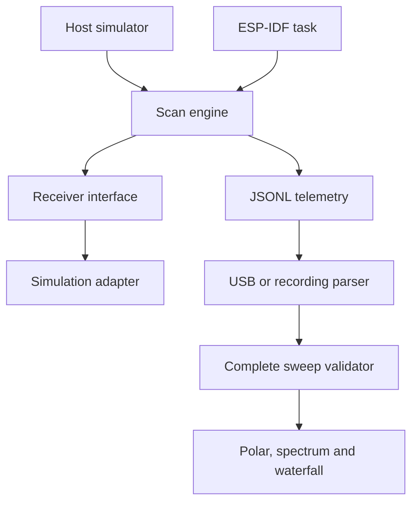

# Architecture

## Implemented v0.1

The same `rf::Scanner` C++17 class runs on a host and in ESP-IDF. Its only dependency is a `Receiver` interface (`supports`, `tune`, `read`, `standby`). One task owns the receiver and scanner; the interface is deliberately not thread-safe. The supplied adapter is deterministic simulation only.

- Scan plans use integer Hz and a 64-bit intermediate for frequency arithmetic.
- The scan array has 512 slots; invalid plans are rejected before tuning.
- `tick` takes a monotonic millisecond clock. It never delays, allocates or reads before dwell time; a delayed task does not invent samples to catch up.
- A tune/read/sample error invokes standby and enters fault. Stop is idempotent. A valid start can recover from fault.
- Each receiver must validate its actual frequency range and settling-time requirement, and return promptly from tune/read. The simulation requires no physical settling.
- Firmware stores the scan object statically so its sample array is not placed on the task stack.
- Browser history retains 100 sweeps. Export retains at most 20,000 samples, dropping complete old sweeps. File ingestion rejects files above 8 MiB.
- Only complete, ordered sweeps are committed to charts. Changing frequency grid or source clears peak hold and history. Labels preserve simulation/device provenance across USB and recording ingestion; provenance is supplied by firmware, not cryptographically verified.

## Extension boundaries

1. Implement CC1101 receiver behind `Receiver` after the physical module is selected. Unit-test SPI transactions with a fake bus, then validate RSSI against known lab inputs.
2. Implement Si4735 through a separate I2C adapter. Preserve its actual units and receiver limits; do not label arbitrary radio quality values as calibrated dBm.
3. PCNT/RMT pulse data needs its own typed event schema, not fabricated RSSI. Capture ISR work must be bounded and handed to a task through a fixed queue.
4. Add device commands with a bounded queue owned by the RF task. Require versioned acknowledgements and configuration validation before accepting user changes. No command channel is present in v0.1.
5. Add recording sessions, calibration metadata and measured receiver bandwidth once hardware results exist.

No RF transmission, remote device control, cloud service, authentication, NVS configuration, OTA or physical radar measurement is implemented. No claim is made about scan sensitivity, maximum range or production readiness.

## Development workflow

Keep domain code independent of ESP-IDF. Add a fault-injection test with each hardware adapter. Keep simulation marked as simulation even when running on a physical ESP32. Run host tests before opening a PR; verify both firmware matrix builds and browser flows. `CLAUDE.md` provides repository guidance for Claude Code and other coding agents; it is not an installed Claude skill or a claim that Claude executed this work.
