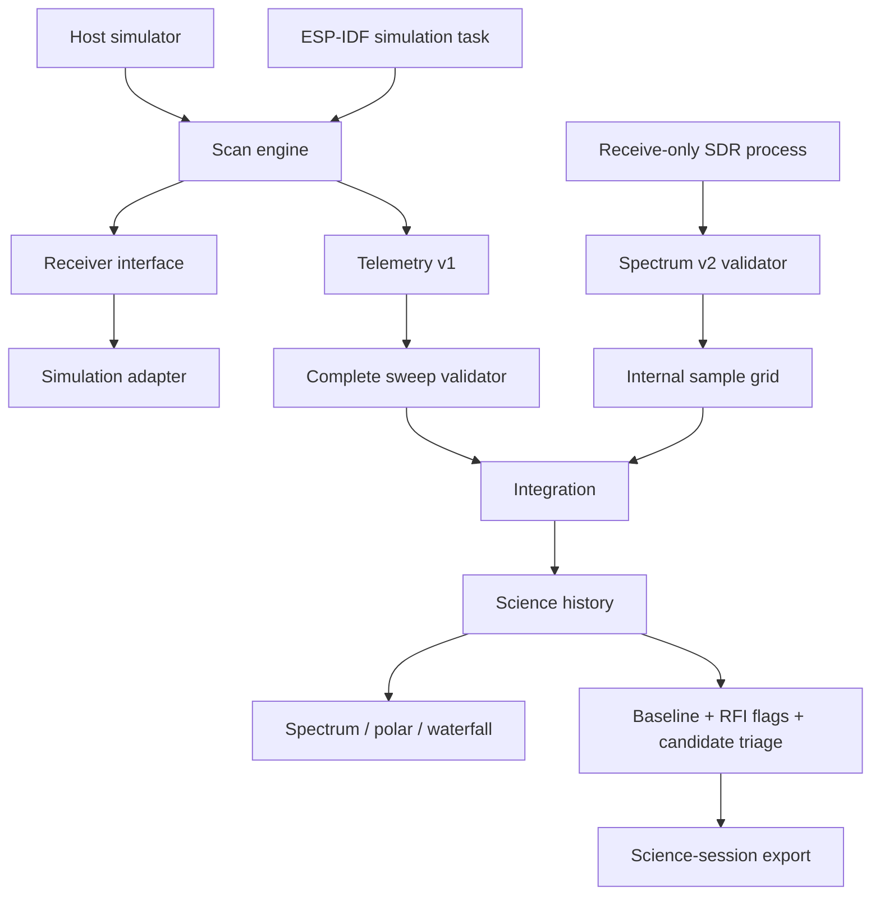

# Architecture

## Implemented v0.5

The portable `rf::Scanner` C++17 core remains independent from ESP-IDF and browser code. Physical receiver work is isolated behind acquisition boundaries rather than leaking device-specific assumptions into science processing.

## Invariants

- Scan plans use integer Hz and bounded arrays.
- Browser/file/device data is validated before charts update.
- Integration only accepts matching frequency grids and sources.
- Sweep averaging is performed in linear power space, then converted back to dBm.
- RFI masks annotate evidence instead of silently deleting it.
- Calibration state is explicit and cannot be inferred from a strong peak.
- A science candidate is not evidence of extraterrestrial origin.
- The current device command surface is intentionally absent.

## Hardware separation

CC1101 and Si4735 remain narrow receive-only laboratory adapters. Space-science acquisition is expected to come from a suitable receiver/SDR through Spectrum v2. ESP32 can supervise station health and telemetry without being treated as a broadband science ADC.

## Scope

No RF transmission, jamming, communications interception/decryption, military target tracking or physical radar measurement is implemented.
